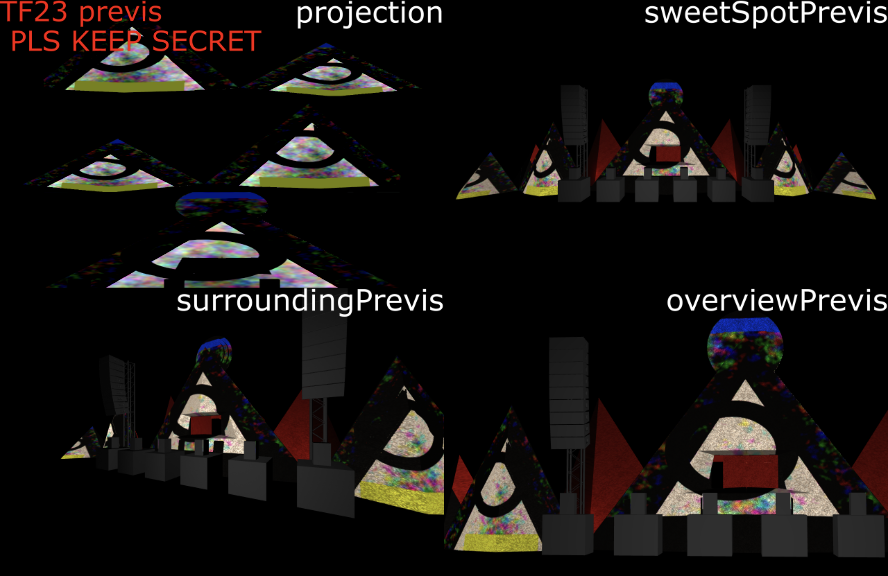

# Mapping Previs for TF23 main stage
## Please to not share, we want the stage to be a suprise!

This is just for experimentation for now. The actual mapping may work differently.

Luka Gores has made this stage design. Builders will be constructing it to align with the 3d models.

# Features
- The projection elements of the stage is made up of 5 pyramids and a moon above the middle pyramid
- Previs stage has a wood texture to give an idea of how visuals are effected by the material
- We will have some form of this program running on the server computer interpreting your output, mapping it and sending it to the projectors
- The assigned A/V tech will maintain the mapping alignment and assist in mapping
- You will have control over how this maps so you have flexibility over how you use your visuals with the stage
- We can keep an updated mapping file sources from this program if you want to use a UV/position map or other data as a source for generative content.
- The server has 2 hdmi inputs so you may be able to use each input for a different HD element if desired

# Installation (resolume example)
1. Install touchdesigner https://derivative.ca/download
2. Open the .toe
3. Start spout output in resolume
4. Select the resolume spout in the spoutIn OP

6. Choose your mapping with the mapping OP 

8. Press F11 to go fullscreen
9. ???
10. Profit!!!

# Plans
- Different things on different pyramids 
- Moon
- Smooth VJ crossover?
  - We have 2 hdmi, can we have each do a different mapping and let the vj outputs blend together? Nice n easy

# Bugs
There is a plank on either side that isn't rendering for some reason...

# Issues/requests
Please contact me at edeetee@gmail.com or make an issue if you see a bug or have a suggestion on how we should map it or what inputs you as a VJ should have control over.
