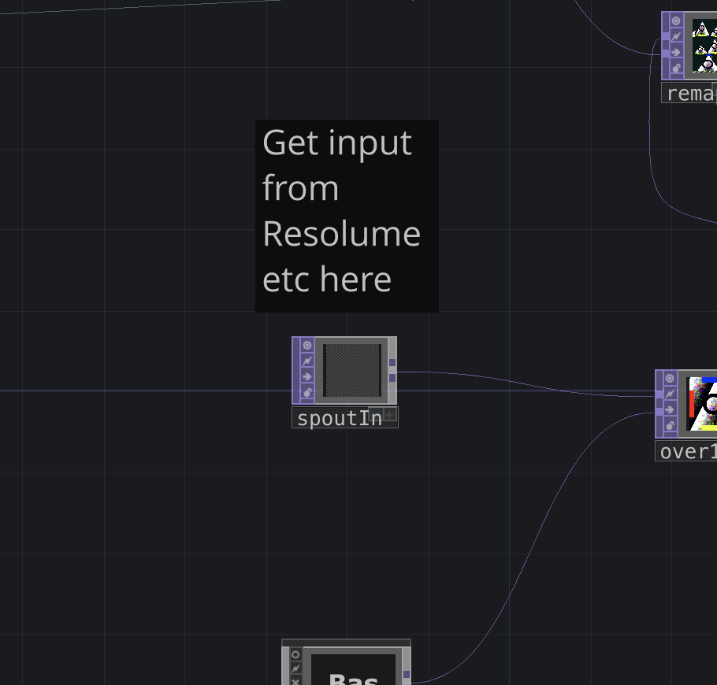
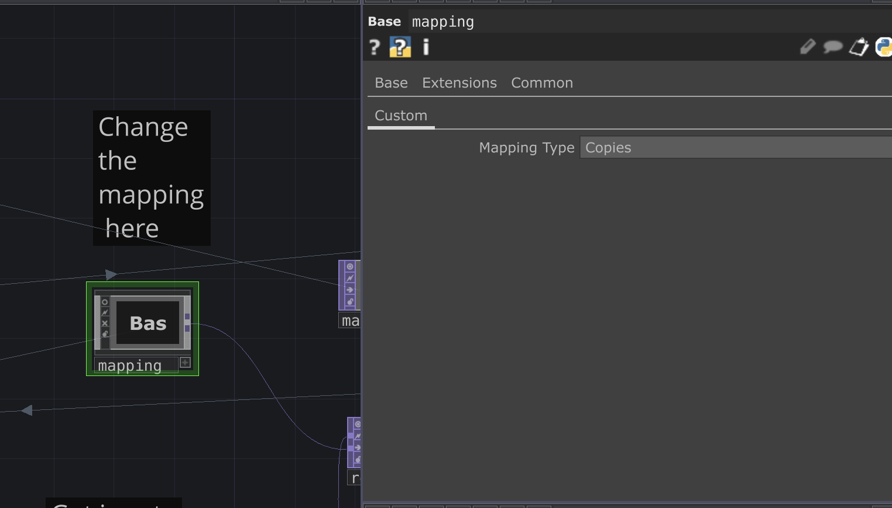

# Mapping Previs for TF23 main stage
Please to not share
We want the stage to be a suprise!

This is just for experimentation for now. The actual mapping may work differently.

# Installation (resolume example)
1. Install touchdesigner https://derivative.ca/download
2. Open the .toe
3. Start spout output in resolume
4. Select the resolume spout in the spoutIn OP 
5. Choose your mapping with the mapping OP 
6. Press F11 to go fullscreen
7. ???
8. Profit!!!

# Plans
- Different things on different pyramids 
- Moon

# Bugs
There is a plank on either side that isn't rendering for some reason...

# Issues/requests
Please contact me at edeetee@gmail.com or make an issue if you see a bug or have a suggestion on how we should map it or what inputs you as a VJ should have control over.